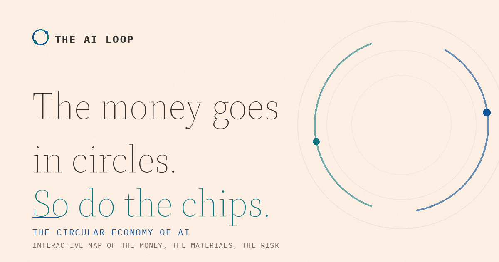

# The AI Loop: Financial Times edition

> A reskin of The AI Loop in the visual language of the Financial Times (salmon paper, serif headlines, Oxford-blue / teal / claret accents). Same sections and interactions as the base project; the June 2026 research expansion (SpaceX, the power layer, the seven-signal debate strip and the look-through proxies) landed in this edition first.

**An interactive map of the circular economy of AI**: who invests in whom, who buys it back, the share prices, the energy it burns, and the bubble debate. A single self-contained web page built from public reporting, current through June 2026.



> The money goes in circles. So do the chips. Nvidia funds OpenAI, which buys Nvidia chips. AMD hands OpenAI a slice of itself in exchange for orders. Microsoft, Amazon and Google pour billions into model labs that pour it back into their clouds.

**Live demo:** [timothy22000.github.io/ai-loop](https://timothy22000.github.io/ai-loop/) (GitHub Pages) · mirror: [t22000t-ai-loop.static.hf.space](https://t22000t-ai-loop.static.hf.space) (Hugging Face Space)

---

## What it does

- **An interactive money-loop graph.** Tap any company to trace what it invests (gold) and what it spends back (teal), with every deal flagged as *confirmed*, *reported*, *letter of intent*, or *stalled*.
- **Follow the dollar.** Three worked examples of the recurring loop shape.
- **Bubble or boom.** The bear and bull cases side by side, sourced and even-handed.
- **The other circular economy.** Hardware reuse, ~13 GW of hyperscaler nuclear deals, water and cooling.
- **The connected companies.** A live-ish table of ~33 public names with prices and market caps, plus private valuations, filterable by layer (chipmakers, power, networking, equipment, energy, space and more).
- **Trace the loop.** A control steps through the real closed cycles in the data (including the Nvidia, OpenAI, Oracle, Nvidia "Stargate triangle"), lighting each circuit and explaining it.
- **See the whole supply chain.** An "All companies" toggle zooms out to an outer ring of fourteen supporting companies (foundries, memory, equipment, power, networking, energy, infrastructure) and their links into the core; tap any to see what it supplies.
- **Filter by type.** Graph chips isolate chipmakers, model labs, hyperscalers and the rest; the company table adds live search and category chips.
- **Every deal is sourced.** Each flow links to a primary announcement or major-outlet report with a verified date, listed in full in a Methodology & sources section.
- **Shareable and embeddable.** Deep links open a specific company (`?focus=nvidia`), an embed button copies an iframe, plus native share, copy link, and prefilled X / LinkedIn / WhatsApp / Reddit / email.
- **Print friendly and installable.** A print stylesheet produces a clean handout, and a full favicon / app-icon set with a web manifest.
- **Optional privacy-friendly analytics.** Plausible or GoatCounter, off by default, enabled from one line of config.
- **Contribute.** A structured "send a correction" channel.

## How it's built

Plain HTML, CSS and vanilla JavaScript in one file. No framework, no build chain for the page itself, no runtime dependencies. The network graph is hand-drawn SVG with a `requestAnimationFrame` pulse animation; the social card is a generated PNG. The only build step is a small Python script that injects the dataset into the page.

```
ai-loop/
├── index.html              # the site (data block is generated; do not hand-edit it)
├── og-image.png            # 1200x630 social preview (regenerate with make_og.py)
├── favicon.svg             # icon set + web manifest (regenerate with make_icons.py)
├── favicon-32.png
├── apple-touch-icon.png
├── icon-192.png
├── icon-512.png
├── site.webmanifest
├── data/
│   ├── deals.json          # SINGLE SOURCE OF TRUTH; edit this
│   ├── companies.csv       # exported table with categories (generated)
│   ├── deals.csv           # exported edge list with sources (generated)
│   ├── README.md           # Hugging Face dataset card
│   └── snapshots/          # dated copies of the data over time
├── schema/
│   └── deals.schema.json   # JSON Schema for deals.json (nodes, edges, loops, companies)
├── scripts/
│   ├── build.py            # deals.json -> index.html + CSVs (use --check in CI)
│   ├── validate.py         # schema + referential checks
│   ├── snapshot.py         # save a dated snapshot
│   ├── make_og.py          # regenerate the social card
│   ├── make_icons.py       # regenerate favicons + web manifest
│   ├── refresh.sh          # one-command local price refresh
│   └── refresh_prices.py   # best-effort price refresh (yfinance)
├── tests/
│   └── test_data.py        # data integrity tests (edges, loops, categories)
├── CHANGELOG.md
└── .github/workflows/
    ├── pages.yml           # deploy to GitHub Pages on push
    ├── validate.yml        # schema + tests + sync check on every PR
    └── refresh.yml         # on-demand price refresh (manual trigger only)
```

## Updating the data

All figures live in **`data/deals.json`**. The page reads a copy that `build.py` injects between the `<!-- DATA:START -->` / `<!-- DATA:END -->` markers, so you never hand-edit numbers inside the HTML.

```bash
# 1. edit data/deals.json
# 2. regenerate the page + CSV exports
python scripts/build.py
# 3. commit
git commit -am "Update deals as of <date>"
```

`build.py` validates the data first (every edge points to a real node, every status and group is from the allowed set) and refuses to build if something is off.

### Optional: refresh prices on demand

There is **no scheduler**. The refresh only runs when you trigger it, in whichever way suits you:

**Locally (simplest, fastest):**
```bash
./scripts/refresh.sh           # installs yfinance, refreshes US prices, rebuilds
git diff data/                 # review the changes
git commit -am "Refresh data"  # commit when you're happy
```

**From GitHub, with a button:** Actions tab → **Refresh data (manual)** → **Run workflow**. Choose `preview` to just see the diff in the run summary (nothing is changed), or `commit` to refresh and commit in one go. One-time setup for `commit`: Settings → Actions → General → Workflow permissions → "Read and write permissions".

**From your terminal via the GitHub CLI:**
```bash
gh workflow run "Refresh data (manual)" -f mode=commit
```

It is **best-effort**: yfinance is unofficial, foreign listings (`.KS`) are skipped to avoid currency mix-ups, and private valuations (OpenAI, Anthropic, xAI) stay manual. Always review the diff before committing.

### What goes stale, and how often

| Field | Changes | Source of truth |
|---|---|---|
| Share price / market cap | Constantly | `refresh_prices.py` (US tickers) or manual |
| Private valuations | Per funding round | Manual |
| Deal status (LOI → signed → stalled) | Per news cycle | Manual, with a source link |
| New / removed deals | Ongoing | Manual edit to `nodes` + `edges` |
| `meta.lastUpdated` | Every refresh | Auto-bumped by the scripts |

## Data dictionary (`deals.json`)

- **`meta`**: `lastUpdated` (ISO), `lastUpdatedLabel` (shown on the page), `tagline`, `note`.
- **`nodes`**: `id`, `name`, `type`, `x`, `y` (graph position), optional `big`.
- **`edges`**: `from`, `to` (node ids), `kind` (label), `group` (`invest` | `spend` | `backstop`), `amt`, `status` (`confirmed` | `reported` | `loi` | `stalled`).
- **`companies`**: `company`, `ticker`, `price`, `mktcap`, `note`.
- **`tape`**: `label`, `value`, optional `teal`.

## Quality checks

`data/deals.json` is validated against `schema/deals.schema.json`, covered by `tests/test_data.py`, and `python scripts/build.py --check` confirms the page is in sync with the data. The `validate.yml` workflow runs all three on every push and pull request, so a malformed contribution cannot merge. Save a dated snapshot anytime with `python scripts/snapshot.py`, and regenerate the social card with `python scripts/make_og.py`.

The CSVs in `data/` double as a Hugging Face dataset; `data/README.md` is the dataset card. You can publish them as a Dataset alongside the Space.

## Run locally

It's a static page, so any static server works (some browsers block the native share sheet on `file://`):

```bash
python -m http.server 8000
# then open http://localhost:8000
```

## Deploy

**GitHub Pages**: push to `main`; the included `pages.yml` workflow publishes the repo root. Or in repo Settings → Pages, choose "Deploy from a branch" → `main` / root.

**Hugging Face Space (static)**: create a new Space with SDK **Static**, then add `index.html`, `og-image.png`, and a `README.md` containing the Space front-matter (see `SPACE_README.md` in this repo, rename it to `README.md` inside the Space). The Static SDK serves `index.html` automatically.

**Social previews**: `index.html` ships with OpenGraph + Twitter Card tags pointing at `og-image.png`. Once you know your live URL, switch the two relative image paths to absolute URLs (commented in the `<head>`) for reliable previews on LinkedIn.

## Contributing

Corrections and new deals are welcome, see [CONTRIBUTING.md](CONTRIBUTING.md).

## License

Code is released under the [MIT License](LICENSE). The compiled dataset (`data/`) is shared under **CC BY 4.0**: reuse it freely with attribution.

## Disclaimer

Built from public reporting. "Reported" and "letter of intent" figures are intentions or media reports, **not** confirmed cash. Prices are snapshots. **This is not investment advice.**
